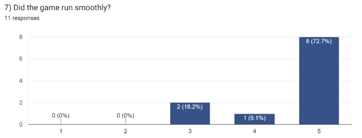

# 1.4a Features of Proposed Solution

## Features of my Proposed Solution to the issue described in [<mark style="color:blue;">1.1 Problem Identification</mark>](1.1-problem-identification.md)

## Features:

### 2D View:

The game which I would like to develop will be a 2D platform, side scroller. This is due to the fact that 2D games provide the players with a unique perspective of the events and also, it doesn't require any powerful hardware to run.

The game will focus the player in the centre of the screen and follow them as they move across the landscape. This should influence a sense of consistency throughout the experience. Furthermore, the player is forced to explore and travel deeper into the environment in order to complete the level. This plays nicely into the exploration aspect which many gamers love, similar to that of Sonic the Hedgehog (see below).

<figure><figcaption>
<a href="../reference-page.md"><mark style="color:blue;">(</mark><em><mark style="color:blue;">Sonic the Hedgehog Classic</mark></em><mark style="color:blue;">, n.d.)</mark></a>
</figcaption></figure>

### Controls:

&#x20;I will definitely include rather basic game controls to allow younger audiences to grasp the game with ease. However, the game will get harder over time so therefore, it should not be too easy to complete and still allow a unique experience for older players.

At the moment, each player movement action will have a dedicated key. This technique has been used for years and is very popular. Below is the list of keys I will be using:

| Control Key                   | Action                                                                                                                                                                                                                                                                                                                                                                                                                                                                                                                                                                                                                                                                                                                                                                                                                                                           |
| ----------------------------- | ---------------------------------------------------------------------------------------------------------------------------------------------------------------------------------------------------------------------------------------------------------------------------------------------------------------------------------------------------------------------------------------------------------------------------------------------------------------------------------------------------------------------------------------------------------------------------------------------------------------------------------------------------------------------------------------------------------------------------------------------------------------------------------------------------------------------------------------------------------------- |
| W & S                         | 
The 'W' and 'S' keys will be used to move the character upwards and downwards respectively. Again, these keys should be comfortable for the user since your left hand usually rests on those keys. I expect that the player will use their middle-finger to press both the 'W' and the 'S' key. This is because the user will not need to press both keys at the same time, therefore allowing their middle-finger to move back and fourth.  This configuration shouldn't be too difficult to grasp since most computer games today reserve the W,A,S and D keys for movement. I have chosen to use these keys instead of the arrow keys because "the arrow keys are not ergonomic to use in conjunction with a right-handed mouse." <a href="../reference-page.md"><mark style="color:blue;">(Contributors to Wikimedia projects, 2023)</mark></a>
 |
| A & D                         | The 'A' and 'D' keys will be used to move the character left and right respectively. These keys should be comfortable for the user since your left hand usually rests on those keys. I expect that the player will use their ring-finger to press the 'A' key and their index-finger to press the 'D' key.                                                                                                                                                                                                                                                                                                                                                                                                                                                                                                                                                       |
| Left Mouse Click and Spacebar | I have decided that both Left Mouse Click and the Spacebar will perform the character's attack. These keys have been selected because once again, these are the most common keys used for attacking. Additionally, the spacebar is really easy to access since you generally always have a thumb or finger resting on it.                                                                                                                                                                                                                                                                                                                                                                                                                                                                                                                                        |

### Timer:

I have decided that I will be including a timer in my game. This will help me to create a more competitive atmosphere while playing and further allow players to contend with friends and other gamers.

### Maps and Levels:

Including a range of environments for my game will allow each user experience to be unique and exiting. The different environments may include: forests, deserts, jungles and cities. Unfortunately, creating these different maps may take a large amount of time so I might only be able to include a couple of the listed concepts. However, I will be making the levels clear and simple to navigate to eliminate confusion around the objective of the level.

### Opponents:

I have chosen to add two different types of opponents to my game, a ranged opponent and a melee opponent.

The melee opponent will be very similar to the 'Goomba' from Super Mario Bros. I like the way that they move and have decided that it will fit the game well. 'Goombas' move by sliding left and right until the hit a border, at which point, they 'bounce' and change direction (see YouTube link below). In Super Mario Bros, they do this infinitely until they are defeated - the player makes Mario jump onto it's head.  As opposed to that, I will be adding a hitbox and giving them a health stat, also removing the 'jump on head' method to defeat them. This should entice the player into melee combat with the Goomba like foe - which I have decided to name a 'Grunt'. Similarly to Super Mario Bros, the Grunt will damage the player's character if it bumps into them.

<figure><figcaption>
<a href="../reference-page.md"><mark style="color:blue;">(</mark><em><mark style="color:blue;">Goomba Picture</mark></em><mark style="color:blue;">, n.d.)</mark></a>
</figcaption></figure>



Developing an enemy like this should portray a sense of danger while playing the game. This will also give the player a choice of whether or not the attempt to defeat the enemy or to try and avoid the enemy. This creates a more immersive feel for the user since they feel in control of the outcome of the game.

The second opponent which I will be implementing into my game, will be a ranged, archer like enemy. This opponent will be visually similar to an Archer from Clash of Clans. I love the design and colour scheme used (see below). However, the Archer opponents in my game will be stationary and will track the player's character, firing arrows at them as they journey on past. They will have less health than the Grunts, but I may include multiple tiers of Archers which deal more damage as the player reaches the later levels in the game. I would therefore have to change their colour scheme and appearance to notify the player of this evolution. I have also decided to name the Archer-like opponents 'Twines'.

.png>)

[<mark style="color:blue;">(</mark>_<mark style="color:blue;">Archer from Clash of Clans</mark>_<mark style="color:blue;">, n.d.)</mark>](../reference-page.md)                    [ <mark style="color:blue;">(</mark>_<mark style="color:blue;">Skeleton from Minecraft</mark>_<mark style="color:blue;">, n.d.)</mark>](../reference-page.md)

### Player Character:

The player's character will be designed to be the hero of the game. They will start at the left hand side of the screen at the beginning of each level, similar to Super Mario Bros, and traverse across the platforms to the end of the stage.

The hero will have a set amount of health for each level. This will be displayed on screen in the form of a health bar. This will be an important indicator to the user and allow them to make crucial decisions because of it.

They will be controlled by commonly used keybindings and will have basic movement and attacking actions. The hero will be able to punch/kick, swing a melee weapon of some sort (like a katana or baseball bat) and will occasionally have an option to shoot an unrealistic gun.

Below, you can see an example of what the melee attack may look like.

<figure><figcaption>
<a href="../reference-page.md"><mark style="color:blue;">(</mark><em><mark style="color:blue;">Swinging Sword GIF</mark></em><mark style="color:blue;">, n.d.)</mark></a>
</figcaption></figure>

## Limitations:

### Multiplayer:

I believe that including a multiplayer aspect to my game would be too complicated and take a significantly greater amount of time to implement. I would like to keep it simple and single player, similar to Sonic and Celeste. Additionally, I think that it would be difficult for multiple players to use the same computer. This would cause problems with the key bindings, the coding and with the player experience. Furthermore, this could create multiple bugs in the game - like a mix up between the player's characters and controls - meaning that it would take much longer to produce a clean, fully functioning game.&#x20;

Alternatively, I could add two renders of the same game and have each control set dedicated to one render of the game. However, I still sure that this will still cause too much confusion for both players. Also, rendering two versions of the same game may cause some user's computers to struggle, lag and skip frames. This is not the experience I wish to create so will consequently not be including multiplayer.

### Graphics Quality:

Since I aim to make this game availiable for as many gamers as possible, the graphics quality will be rather low. This should allow for many people to play the game, on almost any device, since there are no high power computing components required. Unfortunately, this may take away from the user's experience, but not too much since the game is focused on combat rather than schenery and visuals.

In addition to to this, I have no experience of graphic design so producing sprites, textures and graphics may prove to be a challenge. Therefore, by reducing the game's graphics quality, I won't have to spend as much time focussed on the graphics.

Lastly, the game should not crash too frequently. This is becasue a buggy game can significantly impact the User's thoughts on a game and can also lead to frustration when playing. This means that the game should also run smoothly at around 30fps (frames per second) to ensure seamless gameplay.

### Saving Progress:

A further limitation of my game is the fact that user's progress will not be saved between sessions. Consequently, player's data will be wiped after closing the page. This is due to the fact that including a data saving method would be far too complex to include in the short time frame which I am provided with. However, this should not pose too much of an issue since the levels should all be fairly simple and not to time consuming to complete. Also, players could contend against each other based upon the timer, rather than by game completion.
